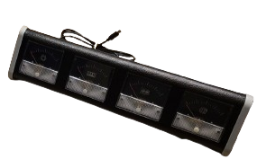
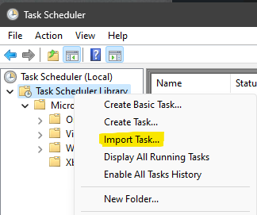
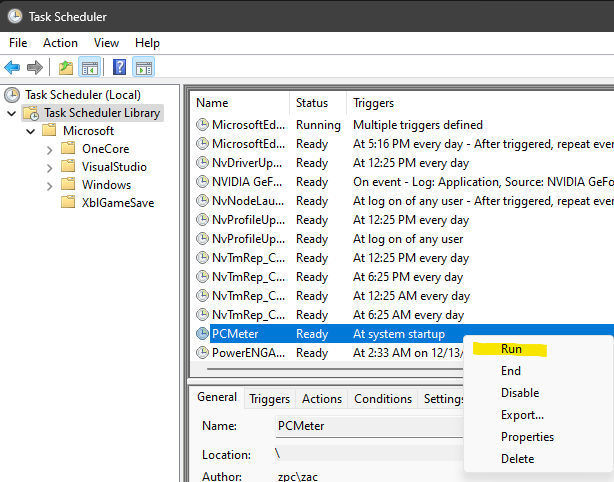

This repo contains powershell scripts to controll your arduino anaolog guage set.

### Quick Test
Download and save PCMeter.ps1 somewhere permanent, I'm using `C:\Users\<YOU>\Documents\GitHub\perfmeter\PCMeter.ps1`
You can run a demo by pasting the following command in your powershell terminal:

```
iex (iwr https://raw.githubusercontent.com/zenvent/perfmeter/main/PCMeter.ps1).Content
```

You should see something like `{"gpu":1,"cpu":0,"ram":18,"net":0}`, and you guage cluster come alive.

If the demo works, proceed with installing it as a service so that it's always running.

### Setup
We can use [PCMeter.xml](PCMeter.xml) to setup a scheduled task in windows.
Open the file and update the filepath to match where you saved the file:

```
<Arguments>-File C:\Users\<YOU>\Documents\GitHub\perfmeter\PCMeter.ps1 -WindowStyle hidden</Arguments>
```

Open Windows Task Scheduler > Action > Import Task...



Righ-Click the task "PCMeter" and click run.
`-File C:\Users\<YOU>\Documents\GitHub\perfmeter\PCMeter.ps1 -WindowStyle hidden`

Here are screenshots of my setup



### Troubleshoot
`Failed to connect to device.`
* Check for driver updates.

`...execution of scripts is disabled...`
* Allow for downloaded powershell scripts to run.
* Make sure you are running powershell as administrator to apply this change.
* You can disable this entirely by running this in powershell: `Set-ExecutionPolicy -ExecutionPolicy Unrestricted`
* You can also allow on an individual basis by running like this: `powershell -ExecutionPolicy Bypass -File C:\Users\<YOU>\Documents\GitHub\perfmeter\PCMeter.ps1`

### Notes
Performance should be neglegable as these metrics are already recorded by windows in the background.
