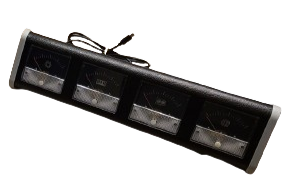

This repo contains powershell scripts to controll your arduino anaolog guage set.

You can run a demo by pasting the following command in your powershell terminal:

```
iex (iwr https://raw.githubusercontent.com/zenvent/perfmeter/main/demo.ps1).Content
```

You should see something like `{"gpu":1,"cpu":0,"ram":18,"net":0}`, and you guage cluster come alive.


If you get an error `Failed to connect to device.`, cheeck for driver updates.

If the demo works, proceed with installing it as a service so that it's always running.
Performance should be neglegable as these metrics are already recorded by windows in the background.

### TODO
* Make a service
